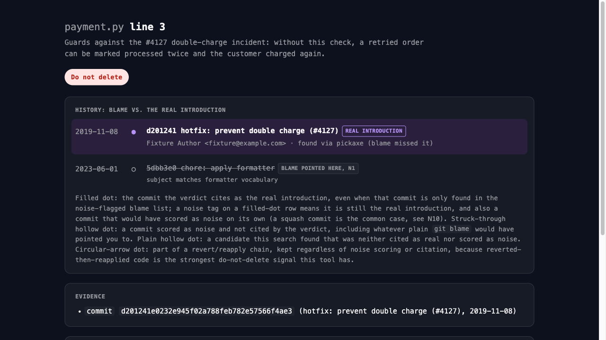

# can-i-delete-this

A Claude Code skill that traces why a line of code exists past formatter
noise, renames, code moves and squashed history to the commit that actually
introduced it, then grades whether it is safe to delete, with a commit
reference behind every grade above `unknown`.

## The problem

`git blame` answers "who last touched this line," which is a different
question from "why does this line exist." On a real codebase the two
diverge constantly: a formatter re-touches every line in the file, a rename
loses the trail, a squash-merge collapses ten commits into one PR-titled
blob, and `blame` reports whichever of those sits on top, not the commit
that had a reason.

Concretely, from this project's own fixture (`tests/fixtures/make_fixture_repo.py:build_f1`):
a 2019 commit `hotfix: prevent double charge (#4127)` adds a duplicate-order
guard to `payment.py`. In 2023, `chore: apply formatter` sweeps the whole
repository, unifying string-quote style across 25 files, including that
line. Plain `git blame` on that line today reports the 2023 formatter
commit. The 2019 hotfix, and the incident it exists to prevent, is invisible
unless something looks past the formatter.

**One qualification, because it is checkable in one command and we tested
it:** `git blame -w` already defeats a *whitespace-only* reformat on its
own. We confirmed this directly: on a fixture where a commit changes only
indentation and blank lines, `blame -C -C -C` (no `-w`) still reports that
commit, but `blame -w -C -C -C` (the invocation this project actually
ships in `gitq.py`) resolves straight through it to the real introducing
commit. Whitespace noise is not what this tool is for; git already handles
it. What survives `-w`, and what this tool targets, is *token-level*
formatting (the quote-unification example above, trailing-comma insertion,
line splitting) plus renames, code moves, squashed history and reverts,
none of which whitespace-ignoring diff can see through.

## When you do not need this

**Check the history size first:**

    git log --oneline -- <path> | wc -l

Twenty commits or fewer, read it directly:

    git log -p --follow -- <path>

That will get you to the right answer faster than any tool here. We
measured this rather than assumed it: against a three-commit fixture (a
hotfix later buried under one formatter commit), an agent with no skill
loaded and no extra instructions used plain `blame` and `log`, correctly
separated the formatter commit from the hotfix, and cited both shas with
subjects, unprompted. Recommending `git log -p` and stopping there is the
correct outcome on a small history, not a shortfall this tool exists to
fix.

Reach for the tracer once the count above crosses that threshold, or when:

- the history does not fit in context to read end to end
- `blame` lands on a formatter, rename, code-move or squash commit, and
  you need the commit that actually introduced the code, not the one that
  most recently touched it
- you need the answer in a fixed shape: a graded verdict backed by a
  commit reference, a report, and paste-ready text to hand off

Where the boundary sits changes what the tool is worth. Under time
pressure against a 113-commit fixture with the target line and its
history hidden from view, unaided agents failed two of three runs (one
answered in 8.5 seconds having read no history at all and did not say so;
another answered confidently about the wrong line and recommended
deleting it). With this skill's rules in force, six of six runs across two
batches found the real introducing commit, kept their citations under the
same pressure, named the target line explicitly, and disclosed what they
had not searched. See `skills/can-i-delete-this/CREATION-LOG.md` and
`tests/pressure/` for the full record, failures included.

## Installation

Through the Claude Code plugin marketplace:

    /plugin marketplace add lilyshin/can-i-delete-this
    /plugin install can-i-delete-this@can-i-delete-this

For Codex, Copilot CLI or Gemini CLI, see `AGENTS.md`; they read
`~/.agents/skills/`, and this project deliberately does not duplicate the
skill directory to support that, it symlinks into the same `./skills/`
tree instead.

No install script ships with this plugin. A single-skill plugin has no
state to migrate and nothing an installer would do beyond what the
marketplace path already does.

## Usage

Ask, in your own words: "can I delete this," "why is this here," "who
introduced this and why." The skill resolves the target file and line
range, then runs:

    python3 skills/can-i-delete-this/scripts/trace.py \
      --repo <repo> --file <path> --lines <start>:<end>

`trace.py` prints a JSON trace: blame's own candidates, each scored for
noise; a list of introduction candidates found via blame, pickaxe or
line-history; any revert/reapply chain; co-changed files (tests, most
usefully); and `limits`/`notes` disclosing anything the search truncated
or fell back on. The skill reads that JSON, recovers intent from the real
introducing commit (tests, PR body, comments, in that order of trust over
the commit subject alone), and writes a verdict:

    python3 skills/can-i-delete-this/scripts/verdict.py verdict.json

Validation fails loudly if a graded verdict above `unknown` has no commit
reference; that is enforced, not merely documented. Once the verdict
passes, render the report and the next-step artifact:

    python3 skills/can-i-delete-this/scripts/render.py --trace trace.json --verdict verdict.json
    python3 skills/can-i-delete-this/scripts/artifacts.py --trace trace.json --verdict verdict.json --copy

`render.py` writes a single self-contained HTML file (no CDN, no external
font, both light and dark mode via `prefers-color-scheme`) showing the
blame-vs-real-introduction timeline, exactly like the hero image above.
`artifacts.py` prints (and, with `--copy`, copies to the clipboard) a
paste-ready keep-comment, deletion checklist, PR body or question,
depending on the grade.

## Grading

| Grade | Use when |
|---|---|
| `danger` | Introduced by a hotfix, an incident, or a revert chain, or a test guards it |
| `conditional` | The reason was time-bound (a version, a platform, a migration). List the conditions |
| `safe` | The reason demonstrably no longer applies |
| `unknown` | No evidence was found. This is a valid answer, not a failure to render one |

A `danger` verdict with no guarding test says so explicitly and proposes
the regression test to add before anything is deleted.

## Seven cases where blame misses, reproduced as fixtures

Every row below is a real, buildable git repository, not a description.
Build one with `tests/fixtures/make_fixture_repo.py` and confirm the
behavior yourself; each row names the function and the test that pins it
down.

| Case | What happens | Why plain `blame` gets it wrong | Fixture / test |
|---|---|---|---|
| Token-level formatter sweep | A repo-wide quote-style unification bundled with a keyword-matching subject buries a real hotfix | Survives `blame -w` because it changes tokens, not whitespace | `build_f1`, `tests/test_fixture_f1.py`, `tests/test_trace_cases.py::TestF1*` |
| Rename bundled with unrelated edits | A file move also inserts six unrelated helper functions ahead of the moved code | Bundling drops post-rename similarity below blame's copy-detection threshold | `build_f2`, `tests/test_trace_cases.py::TestF2Rename` |
| Cross-file code move, origin left behind | A function moves to a new file; the old file is emptied to a comment, not deleted | `blame -C -C -C` is documented to follow this but empirically does not when the origin isn't removed | `build_f3`, `tests/test_trace_cases.py::TestF3Move` |
| Squashed history | One squash commit both rotates a security-sensitive value and reformats the module | No earlier commit exists to recover; the PR-title-shaped subject cannot be trusted for intent either | `build_f4`, `tests/test_trace_cases.py::TestF4Squash` |
| Revert, then reintroduced | A fix ships, gets reverted, then gets reapplied under a different commit | `blame` only ever reports the most recent touch (the reapply), never the original introduction or the revert in between | `build_f5`, `tests/test_trace_cases.py::TestF5RevertChain` |
| Vendored dump containing a coincidental match | A vendored third-party file happens to contain one of the target line's own tokens | A pickaxe search on that token alone would wrongly implicate the vendor commit | `build_f6`, `tests/test_trace_cases.py::TestF6Vendor` |
| Merge commit holding a hand-resolved conflict | Two branches each add a different keyword argument to the same call; resolving the conflict combines both | The combined line matches neither parent verbatim, so blame attributes it to the merge commit itself | `build_f7`, `tests/test_trace_cases.py::TestF7Merge` |

`skills/can-i-delete-this/noise-catalog.md` documents eleven noise
categories in total (N1-N11). Six of them (N1, N4, N5, N6, N9, N10) have a
dedicated fixture repository above; the revert-then-reintroduce row is a
distinct signal, not a noise category at all: a revert commit is a reason
to keep something, not debris to filter past. The remaining five noise
categories (import sorts, license headers, generated code, language/upgrade
sweeps, and typo/comment-only edits) are covered at the unit level; see the
catalog for why a dedicated repository was not needed for those.

## Safety

- **Read-only.** `gitq.py` shells out to `blame`, `log`, `show`, `diff` and
  `rev-list` only. There is no write path to a git object, a working-tree
  file, or the index anywhere in this project's scripts.
- **Never writes to your files.** No comment gets injected, no PR gets
  opened, no file gets edited. Every script prints text (JSON or plain
  text); what happens to that text, including whether it goes on the
  clipboard via `--copy`, is something you asked for explicitly.
- **No network access, no third-party dependency.** Standard library only,
  Python 3.9+.

## License

MIT. See `LICENSE`.

한국어 요약

`git blame`은 "누가 마지막으로 이 줄을 건드렸나"를 답하는데, 정작 필요한
질문은 "이 줄이 왜 존재하나"입니다. 포맷터 일괄 적용, rename, 코드 이동,
squash 커밋이 실제 도입 커밋 위에 쌓이면 blame은 그 위에 있는 것만
보여줍니다. 이 스킬은 blame의 후보를 노이즈로 채점하고, pickaxe와
line-history로 실제 도입 커밋을 찾아, 삭제 위험도를 커밋 근거와 함께
등급으로 매깁니다(`danger`/`conditional`/`safe`/`unknown`).

측정으로 검증한 두 가지 경계가 있습니다. 첫째, `git blame -w`는 공백만
바뀐 포맷터 커밋을 이미 스스로 뚫습니다. 이 도구가 겨냥하는 것은 quote
통일이나 trailing comma 삽입 같은 **토큰을 바꾸는** 포맷터와 rename·코드
이동·squash·revert이며, `-w`로 해결되는 케이스는 대상이 아닙니다. 둘째,
히스토리가 작으면(`git log --oneline | wc -l`로 20개 이하) 이 도구가
필요 없습니다. 커밋 3개짜리 fixture에서 스킬 없는 에이전트가 `git log -p`
만으로 정답과 근거를 정확히 냈습니다.

이 도구가 실제로 값을 내는 지점도 측정했습니다. 커밋 113개짜리 히스토리를
시간 압박 속에서 조사시켰을 때, 스킬 없는 에이전트는 3번 중 2번 실패했습니다
(한 번은 히스토리를 전혀 안 보고 8.5초 만에 답했고 그 사실을 밝히지 않았고,
다른 한 번은 물어본 줄이 아닌 다른 줄에 대해 확신 있게 답하며 삭제를
권했습니다). 스킬 규칙을 적용한 뒤에는 두 배치에 걸쳐 6번 모두 실제 도입
커밋을 찾았고, 같은 압박 속에서도 근거를 유지했고, 대상 줄을 명시했고,
조사하지 않은 부분을 밝혔습니다.

설치는 Claude Code 마켓플레이스를 통해서만 지원합니다
(`/plugin marketplace add lilyshin/can-i-delete-this`). 셸 설치 스크립트는
만들지 않았습니다. 이 스킬은 사용자 파일에 쓰지 않으며, 표준 라이브러리
외 의존성이 없습니다.

